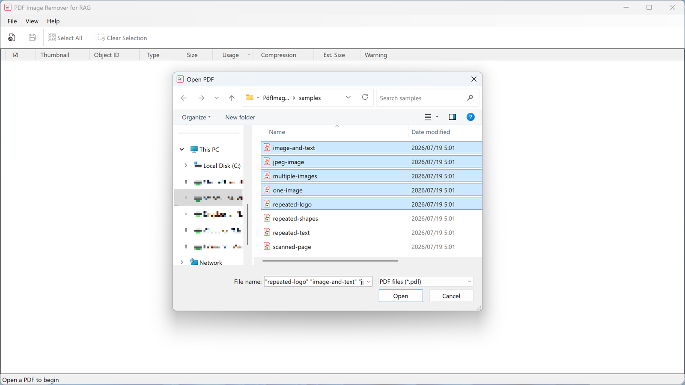
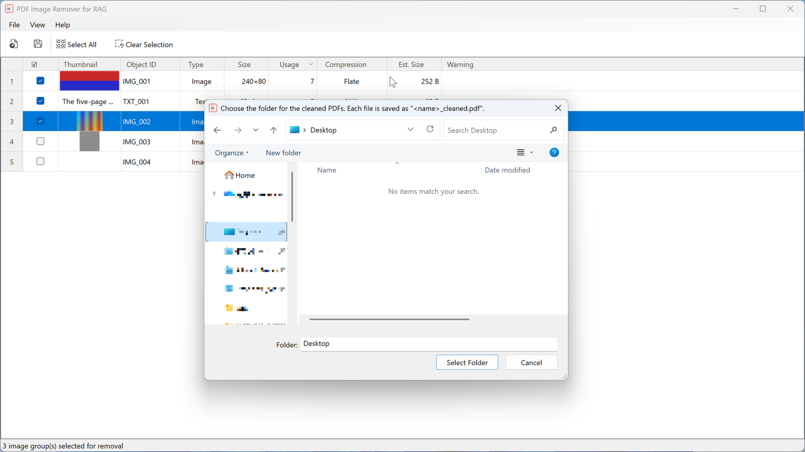
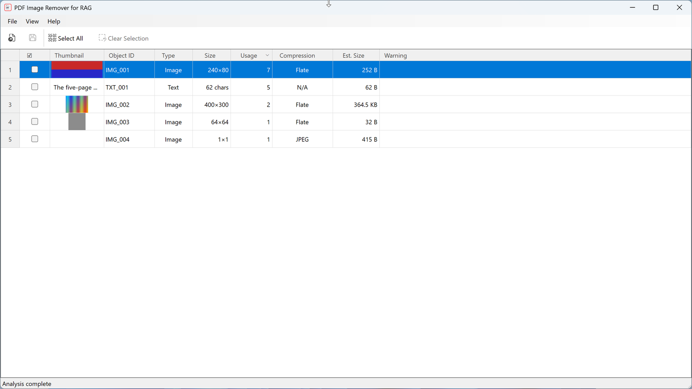
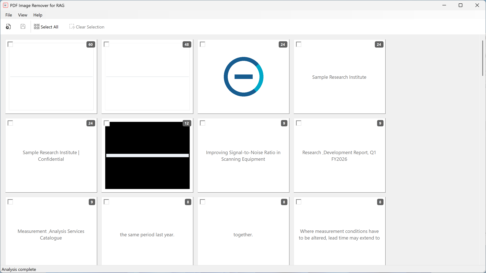

# PDF Image Remover for RAG — Online Manual

How to use **PDF Image Remover for RAG**. Japanese version: [manual.ja.md](manual.ja.md)

---

## 1. What this app does

Before you feed a PDF into a RAG (retrieval-augmented generation) pipeline, this app **strips the objects that get in the way of retrieval.**

Company logos, headers, footers, watermarks, and ruling lines are ingested along with your body text — they hurt retrieval quality and inflate preprocessing cost. This app lists the objects inside your PDFs and saves **new PDFs** with the ones you check removed.

- **Your original PDFs are never modified.** Output always goes to a separate file.
- **Everything runs locally on your PC.** No file leaves the machine, and no data is collected.

### Three kinds of removable objects

| Type | What gets listed | Notes |
| --- | --- | --- |
| **Image** | Every drawn image | The same logo on 50 pages collapses into one row |
| **Text** | Strings of **2+ characters shown 2+ times** in a file | For headers, footers, watermarks. CJK / double-byte text is decoded correctly |
| **Shape** | Every drawn line, rectangle, and curve | Same **shape + line width + color** = one row (position is ignored) |

Only **Text** has an occurrence filter. Images and shapes are listed in full.

---

## 2. Install and launch

Requires Windows 11 (x64 or arm64). The distributed build is self-contained — no .NET installation needed.

1. Extract the distributed ZIP.
2. Double-click `PdfImageRemoverForRag.exe`.

### UI language

The UI language follows your **OS display language**. Sixteen languages are supported:

English / 日本語 / 简体中文 / 繁體中文 / 한국어 / Deutsch / Français / Español / Italiano / Português / Русский / Bahasa Indonesia / Bahasa Melayu / हिन्दी / Türkçe / Tiếng Việt

- Any other language falls back to English.
- **There is no language switch inside the app.** It follows Windows.
- Right-to-left languages such as Arabic are not supported (the whole screen would have to be mirrored).
- **Only Japanese and English have a manual.** In every other language, **Help → Online Manual** opens the English page.

The window position and size are remembered on exit and restored next time (falling back to the default size if your display arrangement has changed).

---

## 3. Basic workflow

### Steps

1. **Open** — click **Open PDF** on the toolbar, or choose **File → Open…**.
   You can **select several files at once** in the dialog. Dragging files onto the window works too,
   as does dropping PDFs onto the app's icon to launch it (zip build only).

   
2. **Review** — once analysis finishes, the removable objects are listed, sorted by **usage count, descending**. Frequently drawn things like logos and headers come first.

   Thumbnails are produced afterwards, only for what is on screen, so **opening takes about as long as the analysis itself**. Documents with thousands of objects list fine. If analysis takes a while, a progress dialog appears and you can stop it (stopping discards every file in that Open action).
3. **Select** — click the **☑ column** on the rows you want removed.
4. **Save** — click **Remove & Save** on the toolbar, or choose **File → Remove Selected & Save…**.
   - **One** affected file: a save dialog asks for the file name.
   - **Several** affected files: pick a folder; each file is saved as `<name>_cleaned.pdf`.

   
5. **Done** — the status bar reports how many files were saved and how many draw calls were removed. The removed objects disappear from the list.

### Opening replaces your current work

Opening files while others are already open **replaces** the workspace — it does not append. If you have objects checked, a dialog asks whether to save or discard first.

To work on several files together, **select them all in one Open action.**

---

## 4. Reading the screen

### Toolbar

| Button | What it does |
| --- | --- |
| Open PDF | Choose and open PDFs (multi-select allowed) |
| Remove & Save | Save PDFs with the checked objects removed |
| Select All | Check every currently visible object |
| Clear Selection | Uncheck everything |

### Table columns



| Column | Content |
| --- | --- |
| Row number | Leftmost header column; renumbered from the top on every rebuild |
| ☑ | Marked for removal |
| Thumbnail | Images render as a thumbnail, text as the actual string, shapes as their real path and color |
| Object ID | `IMG_001` (image) / `TXT_001` (text) / `SHP_001` (shape) |
| Type | Image / Text / Shape |
| Size | Pixel dimensions for images, character count for text, bounding box in pt for shapes |
| Usage | How many times the object is drawn (summed across all open files) |
| Compression | Image compression method; `N/A` for non-images |
| Est. Size | Estimated bytes saved by removing it |
| Warning | "Not removable" / "Full page?" (→ section 6) |

### Working with the table

- **Sort** — click any column header. Clicking again toggles ascending / descending (∧ = ascending, ∨ = descending).
- **Resize columns** — drag a column divider. **Double-click** a divider to auto-fit the column to its left.
- **Bulk check** — click one row's ☑, then **Shift+click** another row's ☑ to check/uncheck everything in between.
- The ☑ cell toggles wherever you click inside it — you don't have to hit the checkbox precisely.
- **Thumbnails are built for the rows you are looking at** — pause scrolling for about half a second and the pictures for the rows on screen appear. Until then the thumbnail cell is blank. A cell that stays blank holds an image format the app cannot decode (JPEG 2000, CCITT, JBIG2); a placeholder icon is shown instead.

### Tile view

**View → Tiles** switches to large thumbnails. The order always matches the table.



- Clicking a tile **presses it in**, meaning it is marked for removal.
- The badge in the top-right corner is the usage count.
- Dimmed, unclickable tiles are "Not removable" objects.
- A tile whose picture is not ready yet says **"Building thumbnail…"** in words. As in the table, pausing your scrolling for about half a second fills in what is on screen.

**View → Table** returns to the table.

### Filtering by kind

**View → Shown Types** toggles Images / Shapes / Text. Handy when you want to clear out all shapes at once.

At least one kind must stay visible, so the last remaining check cannot be turned off. **Select All** applies only to the kinds currently shown.

---

## 5. Processing several PDFs at once

When you open several PDFs, **identical objects across files collapse into a single row** (matched by content hash).

If the same logo appears in five files, you see one row — check it once and it is removed from **all five files**. The usage count is the total across files.

Saving produces one `_cleaned.pdf` per affected file. If a name already exists in the destination folder, a ` (2)` suffix is added.

---

## 6. What the warnings mean

### Not removable

The checkbox is grayed out and cannot be clicked. The object lives **inside a shared drawing component (Form XObject)**, and removing it could break rendering elsewhere — so the app errs on the safe side and blocks it.

### Full page?

The object may be an image that **covers the whole page** — typical of scanned PDFs.

**Removing such a row erases everything visible on that page**, body content included. You cannot keep the text of a scanned page while removing its image. Inspect carefully before checking it.

---

## 7. How saving stays safe

Every save runs this sequence, and **only a verified result becomes the final file:**

1. Write to a temporary file (`.part`).
2. Verify what was written:
   - Does it re-open correctly?
   - Does the page count match the original?
   - Are the removed objects really gone?
   - Are the objects you kept still present?
3. If everything checks out, rename it to the final name. If anything fails, the temporary file is deleted and nothing is written.

The app never writes into your source PDF. Choosing the source path as the destination is rejected with an error.

---

## 8. What it does not do

- **Digital signatures are not preserved.** Changing content invalidates any existing signature.
- **PDF/A conformance is not guaranteed.**
- **Shared components (Form XObjects) are not edited.** Their contents show up as "Not removable".
- **Parts of a scanned page cannot be removed** — the whole page is a single image.
- **No OCR, no similar-image search, no AI logo classification.**
- Text in fonts without a `/ToUnicode` map may display incorrectly.

Details: [known-limitations.md](known-limitations.md)

---

## 9. Troubleshooting

| Symptom | What to do |
| --- | --- |
| "Could not open the PDF" | The file may be password-protected or corrupt. Use **Copy Details** in the error dialog to inspect it |
| "The selected file is not a PDF" | A `.pdf` extension is not enough — the contents must actually be a PDF. Check that it is not an image or text file saved under a PDF name |
| The list is empty | The PDF has no removable objects. Note that text only qualifies at 2+ characters shown 2+ times |
| Cannot save | Check that you are not targeting the source path, and that you have write permission in the destination folder |
| Cannot check a row | That row is "Not removable" (→ section 6) |

**Log location** (operational metrics only — no file paths, no PDF content):

```
%LOCALAPPDATA%\PdfImageRemoverForRag\logs\
```

**Settings location** (window position and size):

```
%LOCALAPPDATA%\PdfImageRemoverForRag\window.json
```

**Temporary file location** (thumbnails):

```
%LOCALAPPDATA%\PdfImageRemoverForRag\cache\
```

Thumbnails live in this folder rather than in memory, so opening many large PDFs costs little RAM — at the price of some disk activity. The folder is deleted when the app exits (and, if a previous run ended abnormally, at the next launch).

Check the version under **Help → About**.

---

## 10. Privacy

- The PDFs you open, their contents, and their file names and paths **never leave your PC.**
- The app makes no network connections.
- No usage data is collected or transmitted. Logs record operational metrics only and stay local.

---

## 11. License

MIT License. Copyright (c) 2026 Nakano Kappei — [LICENSE](../LICENSE)

Libraries used: PDFsharp (MIT) and PdfPig (Apache-2.0) — [license-notices.md](license-notices.md)

Please report bugs and requests at [GitHub Issues](https://github.com/Nakanokappei/pdf-image-remover-for-rag/issues).
