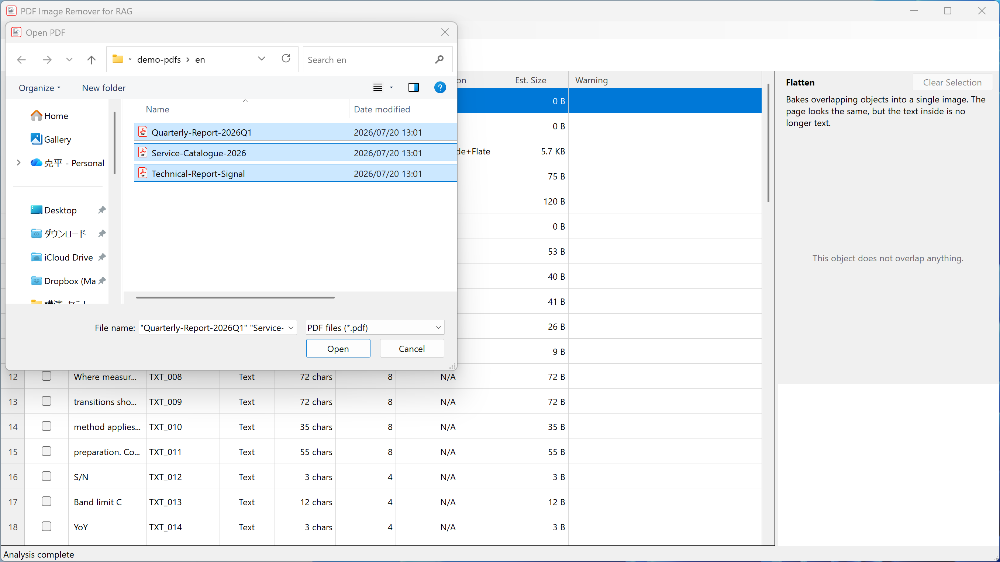
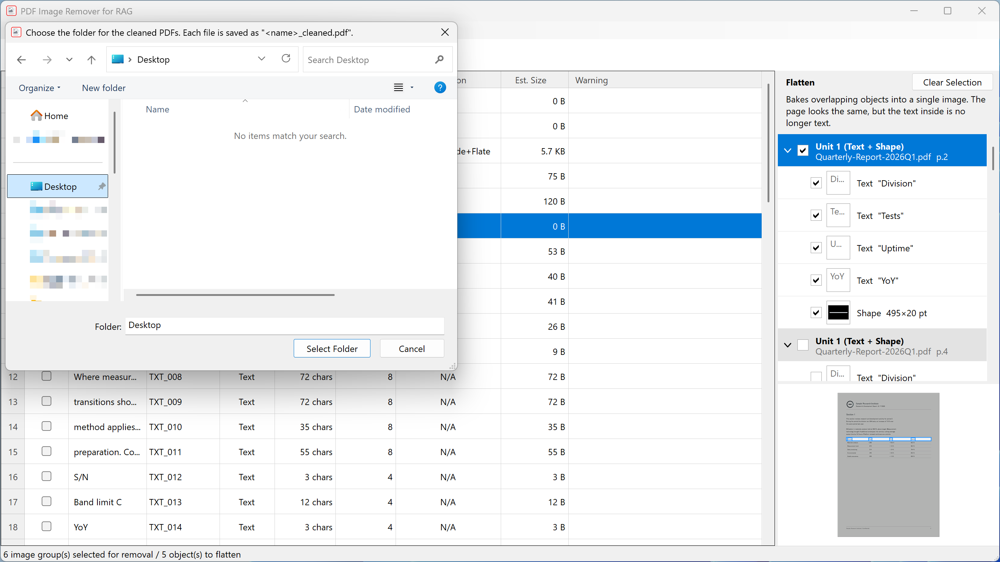
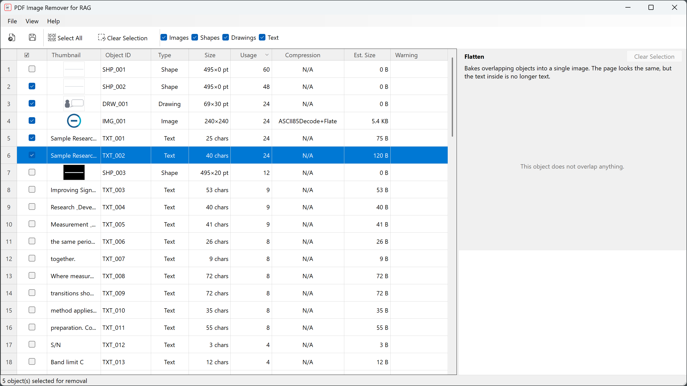
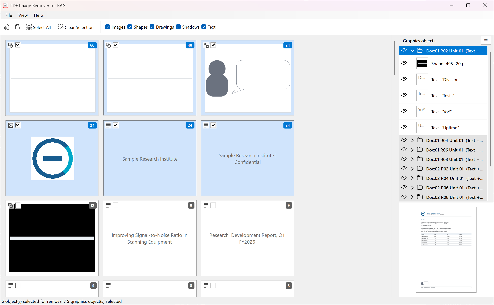
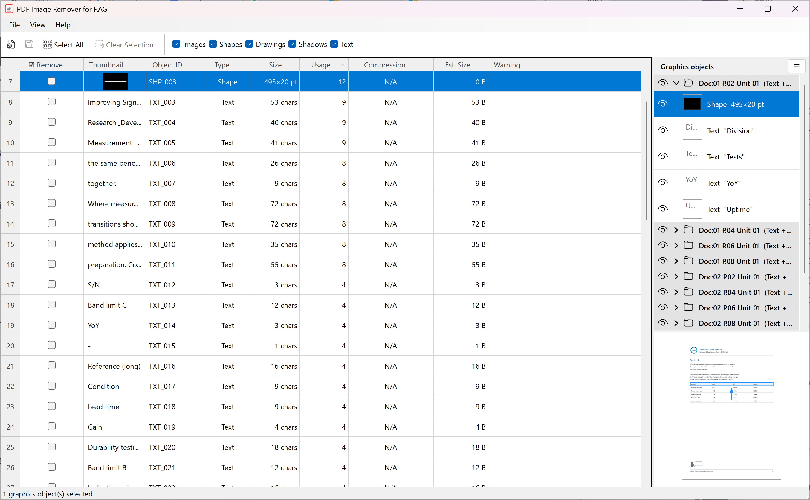

# PDF Image Remover for RAG — Online Manual

How to use **PDF Image Remover for RAG**. Japanese version: [manual.ja.md](manual.ja.md)

---

## 1. What this app does

Before you feed a PDF into a RAG (retrieval-augmented generation) pipeline, this app **strips the objects that get in the way of retrieval.**

Company logos, headers, footers, watermarks, and ruling lines are ingested along with your body text — they hurt retrieval quality and inflate preprocessing cost. This app lists the objects inside your PDFs and saves **new PDFs** with the ones you check removed.

- **Your original PDFs are never modified.** Output always goes to a separate file.
- **Everything runs locally on your PC.** No file leaves the machine, and no data is collected.

### Five kinds of removable objects

| Type | What gets listed | Notes |
| --- | --- | --- |
| **Image** | Every drawn image | The same logo on 50 pages collapses into one row |
| **Text** | Strings with at least one visible character, shown **2+ times** in a file | One character is enough — a confidentiality marking such as "S". Whitespace-only strings are never listed. For headers, footers, watermarks; CJK / double-byte text is decoded correctly |
| **Shape** | Every drawn line, rectangle, and curve | Same **shape + line width + color** = one row (position is ignored) |
| **Drawing** | Artwork placed as a unit | A person silhouette with a speech bubble, and the like: several lines that sit together. The whole picture is removed, not one line at a time |
| **Shadow** | The picture a drop shadow leaves behind | Word processors and presentation tools export a shadow as a picture of one flat color with the blurred outline kept separately. On the page it is a faint shadow; pulled out of the file by other software it is a solid black rectangle. See below |

Only **Text** has an occurrence filter. Images, shapes, drawings and shadows are
listed in full.

### Why shadows have a type of their own

If black rectangles turn up where you expected a diagram, these are almost
always what they are.

PDF has no way to draw a blur, so a shadow has to be exported as a picture. The
picture is one flat color — usually pure black — and the shape of the shadow is
kept apart from it, in a channel that says how much of that color to let
through at each point. Software that reads a PDF page renders the two together
and you see a soft shadow. Software that pulls images out of the file object by
object often keeps only the picture, and a picture of pure black is a black
rectangle.

Removing them costs the page almost nothing, which is why they are listed
separately: check **Shadow** on its own and you can clear them in one pass
without going through the real pictures. Only shadows are affected — a glow,
soft edges or a reflection is exported together with the object it belongs to,
so it stays an ordinary **Image**.

### Two ways to go about it

The window is split left and right, and **both halves are visible at once.**

| | Delete | Flatten |
| --- | --- | --- |
| Where | The **left** of the window (the object list) | The **right** of the window (the Graphics objects panel) |
| What it does | Takes the objects you pick out of the file | Bakes overlapping objects into a single image |
| How the page looks | That much less on it | **Unchanged** |
| Good for | Logos, headers, watermarks, ruling lines | A chart's axis labels, a caption over a photo — text that **breaks the picture if you delete it, but gets in the way of retrieval if you keep it** |

Flattening is covered in section 5.

---

## 2. Install and launch

Requires Windows 11 (x64 or arm64). The distributed build is self-contained — no .NET installation needed.

1. Extract the distributed ZIP.
2. Double-click `PdfImageRemoverForRag.exe`.

### UI language

The UI language follows your **OS display language**. Sixteen languages are supported:

English / 日本語 / 简体中文 / 繁體中文 / 한국어 / Deutsch / Français / Español / Italiano / Português / Русский / Bahasa Indonesia / Bahasa Melayu / हिन्दी / Türkçe / Tiếng Việt

- Any other language falls back to English.
- **There is no language switch inside the app.** It follows Windows.
- Right-to-left languages such as Arabic are not supported (the whole screen would have to be mirrored).
- **Only Japanese and English have a manual.** In every other language, **Help → Online Manual** opens the English page.
- **You can start it in another language just once** by passing `--language` on the command line. Your Windows setting is untouched; it applies to that run only.

  ```
  PdfImageRemoverForRag.exe --language en
  PdfImageRemoverForRag.exe report.pdf --language ja
  ```

  The tags are the sixteen above (`ja` `en` `zh-Hans` `zh-Hant` `ko` `de` `fr` `es` `it` `pt` `ru` `id` `ms` `hi` `tr` `vi`). It is **for the zip build**, where the exe is yours to start from a command line.

The window position and size are remembered on exit and restored next time (falling back to the default size if your display arrangement has changed).

---

## 3. Basic workflow

### Steps

1. **Open** — click **Open PDF** on the toolbar, or choose **File → Open…**.
   You can **select several files at once** in the dialog. Dragging files onto the window works too,
   as does dropping PDFs onto the app's icon to launch it (zip build only).

   
2. **Review** — once analysis finishes, the removable objects are listed, sorted by **usage count, descending**. Frequently drawn things like logos and headers come first.

   Thumbnails are produced afterwards, only for what is on screen, so **opening takes about as long as the analysis itself**. Documents with thousands of objects list fine. If analysis takes a while, a progress dialog appears and you can stop it (stopping discards every file in that Open action).
3. **Select** — click the **☑ column** on the rows you want removed. From the keyboard, land on the row and press **Space**.
4. **Save** — click **Remove & Save** on the toolbar, or choose **File → Remove Selected & Save…**.
   - **One** affected file: a save dialog asks for the file name.
   - **Several** affected files: pick a folder; each file is saved as `<name>_cleaned.pdf`.

   
5. **Done** — the status bar reports how many files were saved and how many draw calls were removed. The removed objects disappear from the list.

### Opening replaces your current work

Opening files while others are already open **replaces** the workspace — it does not append. If you have objects checked, a dialog asks whether to save or discard first.

To work on several files together, **select them all in one Open action.**

---

## 4. Reading the screen

### How the window is laid out

Below the toolbar the window is split left and right.

- **Left — the object list.** The main thing this app does. It switches between a table and tiles, and the removal check boxes go here.
- **Right — the Graphics objects panel.** It shows where the object on the **currently selected row** overlaps something else. It takes a share of the width until you drag the divider; after that the width is yours and resizing the window leaves it alone.

- **The toolbar's Select All and Clear Selection act on the object list only.** Merging is done a unit at a time in the panel — there is no one-click "flatten every overlap in the document", because that would make the target of an irreversible operation impossible to predict. In the panel, clicking another row is what moves its selection.
- **Remove & Save is available as soon as there is something to write** — an object checked for removal, an eye closed, or a place already merged.
- The status bar reports **both** counts, e.g. `3 object(s) selected for removal / 4 object(s) to flatten`.

### Toolbar

| Button | What it does |
| --- | --- |
| Open PDF | Choose and open PDFs (multi-select allowed) |
| Remove & Save | Save PDFs with the checked objects removed, along with anything whose eye you closed. Places already merged are written out as they stand |
| Select All | Check every visible object in the object list |
| Clear Selection | Uncheck everything in the object list |

### Table columns



| Column | Content |
| --- | --- |
| Row number | Leftmost header column; renumbered from the top on every rebuild |
| ☑ | Marked for removal |
| Thumbnail | Images render as a thumbnail, text as the actual string, shapes as their real path and color |
| Object ID | `IMG_001` (image) / `TXT_001` (text) / `SHP_001` (shape) |
| Type | Image / Text / Shape |
| Size | Pixel dimensions for images, character count for text, bounding box in pt for shapes |
| Usage | How many times the object is drawn (summed across all open files) |
| Compression | Image compression method; `N/A` for non-images |
| Est. Size | Estimated bytes saved by removing it |
| Warning | "Not removable" / "Full page?" (→ section 7) |

### Working with the table

- **Sort** — click any column header. Clicking again toggles ascending / descending (∧ = ascending, ∨ = descending).
- **Resize columns** — drag a column divider. **Double-click** a divider to auto-fit the column to its left.
- **Bulk check** — click one row's ☑, then **Shift+click** another row's ☑ to check/uncheck everything in between.
- The ☑ cell toggles wherever you click inside it — you don't have to hit the checkbox precisely.
- **The keyboard alone is enough** — **Space** toggles the current row's ☑, and **Shift+Space** extends from the row you last toggled. It works whichever column the cursor is in.
- **Thumbnails are built for the rows you are looking at** — pause scrolling for about half a second and the pictures for the rows on screen appear. Until then the thumbnail cell is blank. A cell that stays blank holds an image format the app cannot decode (JPEG 2000, CCITT, JBIG2); a placeholder icon is shown instead.

### Tile view

**View → Tiles** switches to large thumbnails. The order always matches the table.



- Clicking a tile **presses it in**, meaning it is marked for removal.
- The badge in the top-right corner is the usage count.
- Dimmed, unclickable tiles are "Not removable" objects.
- A tile whose picture is not ready yet says **"Building thumbnail…"** in words. As in the table, pausing your scrolling for about half a second fills in what is on screen.

**View → Table** returns to the table.

> **If you use a screen reader, use the table view.** The tiles are painted onto a single control, so **Narrator cannot read them** (NVDA and JAWS can). The table shows the same objects in the same order, and there is nothing you can do in one view that you cannot do in the other.

### Filtering by kind

The **check boxes on the toolbar**, or **View → Shown Types**, toggle Images / Shapes / Drawings / Shadows / Text. The two are the same switch and always agree. Handy when you want to look at one kind at a time — clearing every kind but **Shadow**, then **Select All**, removes the whole crop of black rectangles in one pass.

At least one kind must stay visible, so the last remaining check cannot be turned off (it springs back if you try). **Select All** applies only to the kinds currently shown.

---

## 5. Flattening an overlap into an image (the Graphics objects panel)

### What it is for

A chart's axis labels, a caption sitting on a photograph, a stamp over a ruling line — this kind of text **breaks the picture if you delete it, and gets in the way of retrieval if you keep it.**

Flattening bakes the place where they overlap into **a single image of exactly what was there.** The page looks the same. What changes is underneath: **the text in that place stops being text.** A RAG pipeline reads the text layer, so that is where it disappears from.

Three things separate it from deleting:

| | Delete | Flatten |
| --- | --- | --- |
| What goes | The objects you pick, **from every file** | The objects you pick, **from that one place** (the same string on other pages survives) |
| How the page looks | That much less on it | Unchanged |
| Number of images | Fewer | The same, or one more |

> **Flattening takes effect when you press it**, not when you save. Checking things for removal takes effect on the save, so the order does not matter. To take a flatten back, use **Undo Flatten**.

### What counts as an overlap

Only places where objects of *different* kinds overlap are listed. That gives four combinations:

**image + text / image + text + shape / image + shape / text + shape**

- **Text over text is excluded.** Baking it would turn words into a picture and gain nothing.
- "Overlap" covers both containment and partial overlap.
- **A shape that only strokes its path** (a frame, a rule, an outline) joins in only when it lies **entirely inside** the other object. A border around the page crosses every paragraph on it, but that is furniture, not an overlap. A filled shape — a shaded heading band, say — joins as soon as it touches.
- **A shape covering the whole page** — a slide background, say — counts as the page itself and joins nothing. It is filled, so it would otherwise touch every object on the page and make one unit out of the whole sheet. **Images are not affected**: text over a scan or a full-bleed photograph still flattens.
- Contents of shared drawing components (Form XObjects) are excluded, for the same reason they are "Not removable" in the object list.

### How to use it



1. **Select the row of the object you want to look at, in the list on the left.** The Graphics objects panel then shows **every place that object is drawn**, with the first of them already selected, so it is ready to act on.
   - Where it overlaps something, the place is a **unit** holding it and whatever it overlaps.
   - Where it overlaps nothing, the place is **a unit of its own**. A header or a page number printed on forty pages is mostly this.
   - With no row selected the panel is empty.
2. The panel is laid out **like an image editor's layers panel**: a **folder is a unit** (`Doc:01 P.02 Unit 01` reads "the first file, its second page, the first unit on it") and the **graphics objects** sit under it. The chevron at a folder's left folds it away.
3. **The eye at the left says whether the object is drawn.** Close it and the object goes from that place on that page — **it leaves the preview as well**, and it will not be in the PDF you save. **Only that one place goes**: the same image on other pages stays. A folder's eye acts on everything inside it.
   - **This is how you take out one drawing and keep the others.** The check box in the list on the left removes the object from **everywhere it appears**; when you want this page's heading gone but not the next page's, close the eye on that place here.
4. **Clicking a row selects it** (Ctrl to add or remove, Shift for a range). What is selected says which UNIT the commands act on.
5. **The commands are under the ☰ at the right of a unit's own row**, and act on that unit (from the keyboard: Enter, Shift+F10 or the Menu key on that row).
   - **Turn the visible objects into a picture** — makes one picture of them, there and then. **Anything whose eye is closed stays out of it**, since the save is going to take it away. **The closed eyes open again afterwards**: "not in this picture" is an instruction that has been carried out once the picture exists.
   - **Turn the selected objects into a picture** — the same, for the rows you picked inside that unit.
   - **Split the selected objects off** — correct a unit by hand when what was detected does not match the document, by moving what you picked into a unit of its own.
   - **Merge units** (the button at the panel's top right) — puts several units of one page together. Select across them, then press it.
   - **Undo the picture** — **right-click the picture's row in the list on the left**. Merging ends the unit its objects came from, so the command lives on the row of what the merge drew.
6. **The preview underneath is that page, actually drawn.** Objects whose eye is closed are not in it. **The selected graphics object is outlined in light blue**, and a small or thin one gets **an arrow in the same color** beside it.
7. **Saving is the same as for deleting** (**Remove & Save** on the toolbar, or **File → Remove Selected & Save…**). The merging has already happened, so the save writes it out. A save with nothing but flattening works fine.

### Worth knowing

- **Text in a flattened area can no longer be selected or copied.** That is the point of the feature. Your original PDF is untouched, so you can always open it again.
- **A merged picture is made at the resolution you chose** in **Tools → Settings** (section 6). That is what keeps it as sharp as the images around it. There is an upper limit whatever you choose, because a whole page at a high resolution is a bitmap large enough to fail to allocate.
- **A place that cannot be rendered is left exactly as it was.** Deleting the objects and then failing to draw their replacement would punch a hole in the page.
- **When what you have selected covers nearly the whole page, the panel says so in red.** Merging it turns that whole page into one image, and none of its text stays text. It is not forbidden — a scan with a caption typed over it is exactly that case, done knowingly.

---

## 6. Making the images smaller (Tools → Settings)

**Every save can redraw the pictures in the output at a smaller size.** It is on by default, because a PDF on its way into a retrieval pipeline nearly always wants it: a manual full of screenshots reaches a 15 MB upload limit easily, and pixels past what anyone reads are file size and nothing else.

**The page does not change.** A PDF draws an image into a rectangle the page decides, scaling whatever resolution the image happens to have, so the same picture with fewer pixels lands in exactly the same place at the same size.

**Nothing is ever enlarged.** An image already under the chosen resolution keeps every pixel it had.

### Choosing a resolution

Open **Tools → Settings**. The list runs from the smallest file to the largest.

| Choice | What it is for |
| --- | --- |
| **Screen** - 92 dpi | The smallest file. Enough to look at; **not** enough for a pipeline to read small print. |
| **For RAG (Latin and Cyrillic)** - 140 dpi | Documents set in Latin or Cyrillic script. Keeps text down to 9 pt readable. |
| **For RAG (CJK and other complex scripts)** - 200 dpi | Japanese, Chinese, Korean, Devanagari and Vietnamese, which pack more strokes or marks into a character. Also the choice to make when you are not sure. |
| **For RAG (documents with fine print)** - 300 dpi | Footnotes, captions and table cells set smaller than the body text. Keeps text down to 6 pt readable. |
| **Print** - 400 dpi | When the cleaned PDF will be printed as well as read. |

Each value is a limit per inch of page. An image is redrawn so that it has no more pixels than the space it occupies is allowed.

The resolutions were measured rather than guessed. Text was rendered at each size, put through this app's own resize step, and read back: 200 dpi is where 9 pt Japanese survives without a character error, and 300 dpi is where 6 pt does. Latin script needs roughly half as much, which is why it has an entry of its own.

**This matters most for scanned pages.** A page that is one large photograph carries its text as pixels, and a pipeline can only read what those pixels show. A page whose text is real text is unaffected: the reduction touches images and never the text layer.

### Seeing what a setting costs

Two samples sit side by side in the window, and every control redraws them through the same code a save runs. Both stand for a picture three inches wide on the page, which is about a third of the width of A4.

- The **figure** is a chart with a line of text set into it at 6, 8, 10 and 12 pt, in the language the app is running in. Text is what breaks first when pixels are taken away, and how small is too small depends on the writing system, so the specimen is in yours.
- The **photograph** carries the detail and the smooth shading that JPEG artifacts show up in.

The caption above each one reports what it would be stored as: the size in bytes, and the size in pixels. The pixel count is the resolution setting's whole effect.

**Magnification** enlarges the view without changing anything that would be saved. The number beside the slider is the true scale on screen, not a step count: at 50% each picture is drawn at half the size it is stored at, which is why it starts below 100% and falls further as the resolution goes up. Above 100% you can drag inside a picture to move around it, or use the arrow keys.

### Quality

**Quality** is the JPEG setting, 50 to 100, and 85 by default.

It reaches two things: pictures the PDF already stores as JPEG, which are written again at this quality when they are resized, and the regions you flatten. **A picture the PDF stores losslessly stays lossless** whatever the slider says, so diagrams, screenshots and line art never come back with rings around their edges. That is why the figure sample does not change as the slider moves and says so.

A JPEG already saved below the setting is left alone rather than written again, because re-encoding costs detail and can cost bytes as well.

### Switching it off

Clear **Shrink images** and every picture is written out exactly as it came in. The resolution and quality stay on screen so you can still see what would have been applied.

### What the status bar says

After a save it reports how many images were made smaller, beside what was removed and what was flattened. A zero is a normal result for a document of vector drawings, where there is nothing to shrink.

---

## 7. Processing several PDFs at once

When you open several PDFs, **identical objects across files collapse into a single row** (matched by content hash).

If the same logo appears in five files, you see one row — check it once and it is removed from **all five files**. The usage count is the total across files.

Saving produces one `_cleaned.pdf` per affected file. If a name already exists in the destination folder, a ` (2)` suffix is added.

---

## 8. What the warnings mean

### Not removable

The checkbox is grayed out and cannot be clicked. The object lives **inside a shared drawing component (Form XObject)**, and removing it could break rendering elsewhere — so the app errs on the safe side and blocks it.

### Full page?

The object may be an image that **covers the whole page** — typical of scanned PDFs.

**Removing such a row erases everything visible on that page**, body content included. You cannot keep the text of a scanned page while removing its image. Inspect carefully before checking it.

---

## 9. How saving stays safe

Every save runs this sequence, and **only a verified result becomes the final file:**

1. Write to a temporary file (`.part`).
2. Verify what was written:
   - Does it re-open correctly?
   - Does the page count match the original?
   - Are the removed objects really gone?
   - Are the objects you kept still present?
3. If everything checks out, rename it to the final name. If anything fails, the temporary file is deleted and nothing is written.

The app never writes into your source PDF. Choosing the source path as the destination is rejected with an error.

---

## 10. What it does not do

- **Digital signatures are not preserved.** Changing content invalidates any existing signature.
- **PDF/A conformance is not guaranteed.**
- **Shared components (Form XObjects) are not edited.** Their contents show up as "Not removable".
- **Parts of a scanned page cannot be removed** — the whole page is a single image.
- **No OCR, no similar-image search, no AI logo classification.**
- Text in fonts without a `/ToUnicode` map may display incorrectly.

Details: [known-limitations.md](known-limitations.md)

---

## 11. Troubleshooting

| Symptom | What to do |
| --- | --- |
| "Could not open the PDF" | The file may be password-protected or corrupt. Use **Copy Details** in the error dialog to inspect it |
| "The selected file is not a PDF" | A `.pdf` extension is not enough — the contents must actually be a PDF. Check that it is not an image or text file saved under a PDF name |
| The list is empty | The PDF has no removable objects. Note that text only qualifies when it has a visible character and is shown 2+ times |
| Cannot save | Check that you are not targeting the source path, and that you have write permission in the destination folder |
| Cannot check a row | That row is "Not removable" (→ section 7) |

**Log location** (operational metrics only — no file paths, no PDF content):

```
%LOCALAPPDATA%\PdfImageRemoverForRag\logs\
```

**Settings location** (window position and size):

```
%LOCALAPPDATA%\PdfImageRemoverForRag\window.json
```

**Temporary file location** (thumbnails):

```
%LOCALAPPDATA%\PdfImageRemoverForRag\cache\
```

Thumbnails live in this folder rather than in memory, so opening many large PDFs costs little RAM — at the price of some disk activity. The folder is deleted when the app exits (and, if a previous run ended abnormally, at the next launch).

Check the version under **Help → About**.

---

## 12. Privacy

- The PDFs you open, their contents, and their file names and paths **never leave your PC.**
- The app makes no network connections.
- No usage data is collected or transmitted. Logs record operational metrics only and stay local.

---

## 13. License

MIT License. Copyright (c) 2026 Nakano Kappei — [LICENSE](../LICENSE)

Libraries used: PDFsharp (MIT) and PdfPig (Apache-2.0) — [license-notices.md](license-notices.md)

Please report bugs and requests at [GitHub Issues](https://github.com/Nakanokappei/pdf-image-remover-for-rag/issues).
