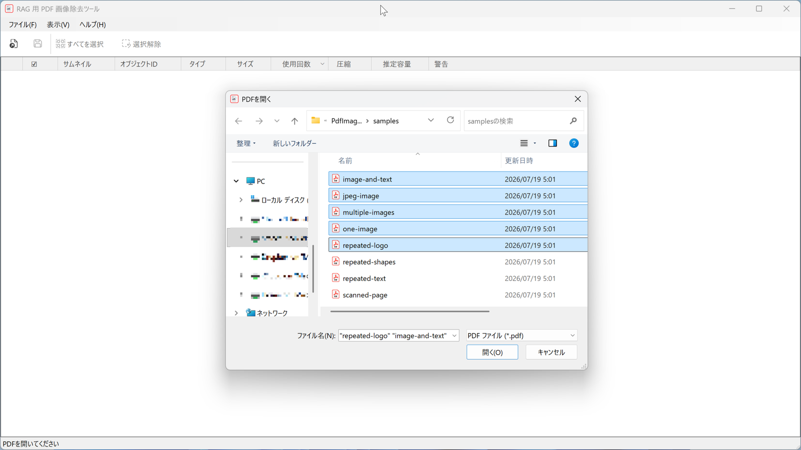
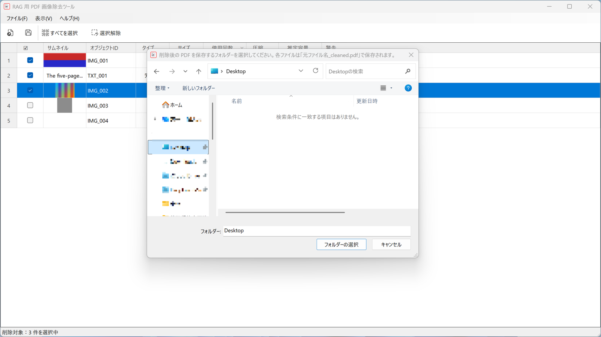
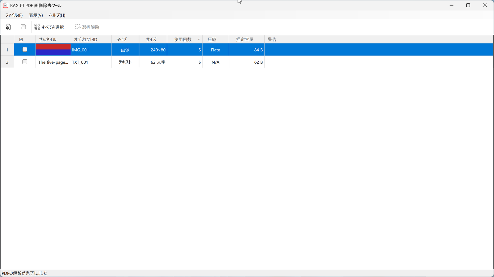
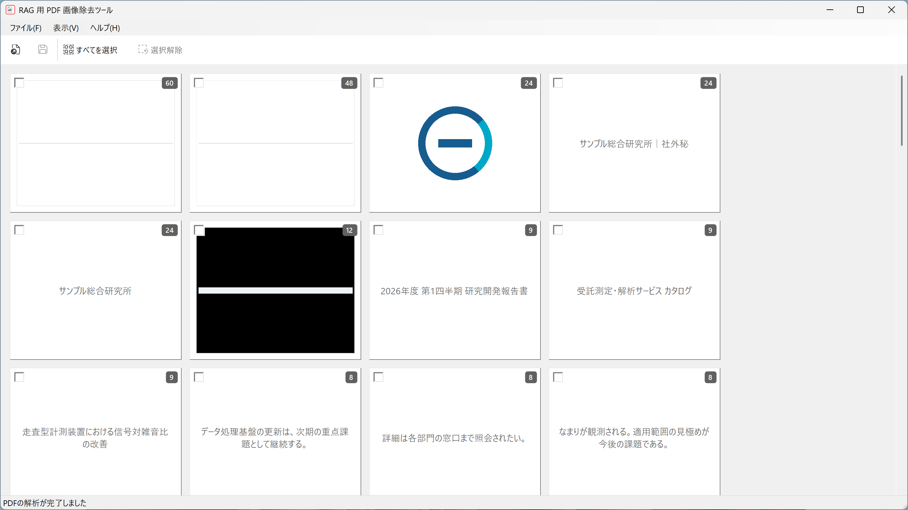

# RAG 用 PDF 画像除去ツール — オンラインマニュアル

**PDF Image Remover for RAG** の使い方です。英語版: [manual.en.md](manual.en.md)

---

## 1. このアプリでできること

RAG（検索拡張生成）に PDF を登録する前に、**検索の邪魔になる余計なオブジェクトを取り除きます。**

会社ロゴ・ヘッダー・フッター・透かし・罫線などは、本文と一緒に取り込まれると検索精度を下げ、前処理コストを増やします。このアプリは PDF の中にあるオブジェクトを一覧表示し、チェックしたものだけを取り除いた**新しい PDF** を保存します。

- **元の PDF は書き換えません。** 保存先は必ず別ファイルです。
- **処理はすべてこの PC の中で完結します。** ファイルが外部に送信されることはなく、データも収集しません。

### 取り除けるオブジェクトは 3 種類

| タイプ | 一覧に出るもの | 補足 |
| --- | --- | --- |
| **画像** | 描画されている画像すべて | 50 ページに出てくる同じロゴは 1 行にまとまります |
| **テキスト** | 同じファイル内で **2 文字以上・2 回以上**現れる文字列 | ヘッダー・フッター・透かし向け。日本語などの 2 バイト文字も正しく読み取ります |
| **図形** | 描画されている線・矩形・曲線すべて | **形状＋線幅＋色**が同じものを 1 行にまとめます（位置は無視） |

回数の絞り込みが入るのは**テキストだけ**です。画像と図形は全件が一覧に出ます。

---

## 2. インストールと起動

Windows 11（x64 / arm64）が必要です。配布ファイルは自己完結型なので、.NET のインストールは不要です。

1. 配布された ZIP を展開します。
2. `PdfImageRemoverForRag.exe` をダブルクリックします。

### 表示言語

表示言語は **OS の表示言語**に従って自動で決まります。対応しているのは次の 16 言語です。

English / 日本語 / 简体中文 / 繁體中文 / 한국어 / Deutsch / Français / Español / Italiano / Português / Русский / Bahasa Indonesia / Bahasa Melayu / हिन्दी / Türkçe / Tiếng Việt

- これ以外の言語の環境では英語で表示されます。
- **アプリ内に言語の切り替えはありません。** Windows の表示言語に従います。
- アラビア語のように右から左へ書く言語には対応していません（画面全体を左右反転する必要があるためです）。
- **マニュアルがあるのは日本語と英語だけです。** ほかの言語では **ヘルプ → オンラインマニュアル** から英語版が開きます。

ウィンドウの位置とサイズは終了時に記憶され、次回同じ場所で開きます（ディスプレイ構成が変わっている場合は既定サイズに戻ります）。

---

## 3. 基本の使い方

### 手順

1. **開く** — ツールバーの「PDFを開く」、またはメニューの **ファイル → 開く…** を選びます。
   ファイル選択ダイアログで **複数のファイルをまとめて選べます**。ウィンドウへのドラッグ＆ドロップ、
   および **アプリのアイコンに PDF をドロップして起動**することもできます（zip 版のみ）。

   
2. **確認する** — 解析が終わると、取り除けるオブジェクトが一覧表示されます。初期状態は**使用回数の多い順**です。ロゴやヘッダーのように何度も使われているものが上に来ます。

   サムネイルは画面に出ている範囲のぶんだけ後から作られるので、**開き終わるまでの時間はほぼ解析の時間だけ**です。オブジェクトが数千件ある大きな PDF でも一覧表示できます。解析に時間がかかるときは進捗ダイアログが出て、途中で中止できます（中止すると、その回に開こうとしたファイルはすべて破棄されます）。
3. **選ぶ** — 取り除きたい行の **☑ 列**をクリックしてチェックを付けます。
4. **保存する** — ツールバーの「削除して保存」、またはメニューの **ファイル → 選択画像を削除して保存…** を選びます。
   - 対象ファイルが **1 つ**のとき: 保存ダイアログでファイル名を指定します。
   - 対象ファイルが **複数**のとき: フォルダーを選ぶと、各ファイルが `元ファイル名_cleaned.pdf` として保存されます。

   
5. **完了** — ステータスバーに保存件数と削除箇所数が表示されます。取り除いたオブジェクトは一覧から消えます。

### 「開く」は現在の作業を置き換えます

すでにファイルを開いている状態で新しく開くと、**現在の作業内容は置き換わります**（追加ではありません）。チェック済みのオブジェクトがある場合は、保存するか破棄するかを確認するダイアログが出ます。

複数ファイルをまとめて扱いたいときは、**最初にまとめて選択して開いてください。**

---

## 4. 画面の見方

### ツールバー

| ボタン | はたらき |
| --- | --- |
| PDFを開く | PDF を選んで開きます（複数選択可） |
| 削除して保存 | チェックしたオブジェクトを取り除いた PDF を保存します |
| すべてを選択 | 表示中のオブジェクトをすべてチェックします |
| 選択解除 | チェックをすべて外します |

### 表（表形式）の列



| 列 | 内容 |
| --- | --- |
| 行番号 | 表の左端。上から連番で振り直されます |
| ☑ | 削除対象のチェック |
| サムネイル | 画像は縮小画像、テキストは文字列そのもの、図形は実際の形と色を描画 |
| オブジェクトID | `IMG_001`（画像）/ `TXT_001`（テキスト）/ `SHP_001`（図形） |
| タイプ | 画像 / テキスト / 図形 |
| サイズ | 画像はピクセル寸法、テキストは文字数、図形は外接矩形の pt |
| 使用回数 | そのオブジェクトが描画されている回数（全ファイル合計） |
| 圧縮 | 画像の圧縮方式。画像以外は `N/A` |
| 推定容量 | 取り除いたときに減ると見込まれるバイト数 |
| 警告 | 「削除不可」「全頁画像?」（→ 6 章） |

### 表の操作

- **並べ替え** — 列見出しをクリックすると並べ替わります。もう一度クリックで昇順／降順が切り替わります（∧ が昇順、∨ が降順）。
- **列幅の変更** — 列の境界をドラッグします。境界を**ダブルクリック**すると左の列が内容に合わせて自動調整されます。
- **まとめてチェック** — ある行の ☑ をクリックしたあと、別の行の ☑ を **Shift を押しながらクリック**すると、その間の行がまとめてチェック／解除されます。
- ☑ 列はセル内のどこをクリックしても切り替わります（チェックボックスを正確に狙う必要はありません）。
- **サムネイルは表示している部分だけ作られます** — スクロールを 0.5 秒ほど止めると、そのとき画面に出ている行のサムネイルが作られて表示されます。それまでサムネイル欄は空欄のままです。空欄が続く場合は、対応していない画像形式（JPEG 2000・CCITT・JBIG2）で、代わりにプレースホルダーのアイコンが出ます。

### タイル形式

**表示 → タイル形式** で、サムネイルを大きく並べたビューに切り替わります。並び順は表と常に同じです。



- タイルをクリックすると**押し込まれた状態**になり、削除対象を意味します。
- 右上のバッジは使用回数です。
- 淡色で押せないタイルは「削除不可」のオブジェクトです。
- サムネイルがまだできていないタイルには「サムネイルを生成中…」と文字で表示されます。表と同じく、スクロールを 0.5 秒ほど止めると画面に出ているぶんが作られて画像に変わります。

**表示 → 表形式** で表に戻ります。

### 種類で絞り込む

**表示 → 表示列** で「画像」「図形」「テキスト」の表示／非表示を切り替えられます。図形だけを一気に消したいときなどに便利です。

最低 1 種類は必ず表示されるため、最後の 1 つのチェックは外せません。また「すべてを選択」は**表示中の種類だけ**を対象にします。

---

## 5. 複数の PDF をまとめて処理する

複数の PDF を開くと、**ファイルをまたいで同一のオブジェクトは 1 行にまとまります**（内容のハッシュで判定）。

同じロゴが 5 つのファイルに入っていれば表示は 1 行で、そこにチェックを 1 回付けるだけで **5 ファイルすべてから取り除かれます**。使用回数は全ファイルの合計です。

保存すると、対象になったファイルの数だけ `_cleaned.pdf` が出力されます。保存先に同名ファイルがある場合は ` (2)` のような連番が付きます。

---

## 6. 警告の意味

### 削除不可

チェックボックスがグレーで押せない行です。そのオブジェクトが**共有された描画部品（Form XObject）の中**にあり、取り除くと他の場所の表示まで壊れる可能性があるため、安全側に倒して削除できないようにしています。

### 全頁画像?

そのオブジェクトが**ページ全体を覆う画像**である可能性を示します。スキャンした PDF によくある形です。

**この行を取り除くと、そのページに見えているものがすべて消えます**（本文を含みます）。スキャン PDF から文字だけを残すことはできません。チェックする前に内容をよく確認してください。

---

## 7. 安全のしくみ

保存は次の順序で行われ、**検証に通ったものだけが最終ファイルになります。**

1. 一時ファイル（`.part`）に書き出す
2. 書き出したファイルを検証する
   - 正しく開けるか
   - ページ数が元と一致するか
   - 取り除いたオブジェクトが本当に消えているか
   - 残すべきオブジェクトが残っているか
3. すべて問題なければ正式なファイル名に変更する（失敗したときは一時ファイルを削除し、何も出力しません）

元の PDF に書き込むことは一切ありません。元ファイルと同じパスを保存先に指定した場合はエラーになります。

---

## 8. できないこと

- **電子署名は維持できません。** 内容を変更するため、署名済み PDF の署名は無効になります。
- **PDF/A への準拠は保証しません。**
- **共有部品（Form XObject）の中は編集しません。**「削除不可」として表示されます。
- **スキャンページの一部だけを消すことはできません。** ページ全体が 1 枚の画像だからです。
- **OCR・類似画像検索・AI によるロゴ判定は行いません。**
- `/ToUnicode` を持たないフォントのテキストは、文字が正しく表示されないことがあります。

詳細: [known-limitations.md](known-limitations.md)（英語）

---

## 9. 困ったとき

| 症状 | 対処 |
| --- | --- |
| 「PDFを開けませんでした」 | パスワード保護された PDF、または破損したファイルの可能性があります。エラーダイアログの「詳細をコピー」で内容を確認できます |
| 「選択されたファイルは PDF ではありません」 | 拡張子が `.pdf` でも、中身が PDF でないファイルは開けません。別の名前で保存された画像やテキストではないか確認してください |
| 一覧に何も出ない | 取り除けるオブジェクトがない PDF です。テキストは「2 文字以上・2 回以上」の条件を満たすものだけが対象です |
| 保存できない | 元ファイルと同じパスを指定していないか、保存先フォルダーに書き込み権限があるかを確認してください |
| チェックが付けられない | その行は「削除不可」です（→ 6 章） |

**ログの場所**（動作の記録。ファイルのパスや PDF の中身は記録されません）:

```
%LOCALAPPDATA%\PdfImageRemoverForRag\logs\
```

**設定の場所**（ウィンドウ位置・サイズ）:

```
%LOCALAPPDATA%\PdfImageRemoverForRag\window.json
```

**一時ファイルの場所**（サムネイル）:

```
%LOCALAPPDATA%\PdfImageRemoverForRag\cache\
```

サムネイルはメモリではなくこのフォルダーに置かれます。大きな PDF をたくさん開いてもメモリ使用量はあまり増えませんが、そのぶんディスクの読み書きが発生します。このフォルダーはアプリの終了時に削除されます（前回の終了が正常でなかった場合は、次回の起動時に消えます）。

バージョンは **ヘルプ → このアプリについて** で確認できます。

---

## 10. プライバシー

- 開いた PDF、その中身、ファイル名やパスが**この PC の外に出ることはありません。**
- ネットワーク通信は行いません。
- 使用状況の収集・送信は行いません。ログは動作の記録のみで、ローカルに保存されます。

---

## 11. ライセンス

MIT License. Copyright (c) 2026 Nakano Kappei — [LICENSE](../LICENSE)

利用ライブラリ: PDFsharp（MIT）/ PdfPig（Apache-2.0）— [license-notices.md](license-notices.md)

不具合の報告・要望は [GitHub Issues](https://github.com/Nakanokappei/pdf-image-remover-for-rag/issues) へお願いします。
