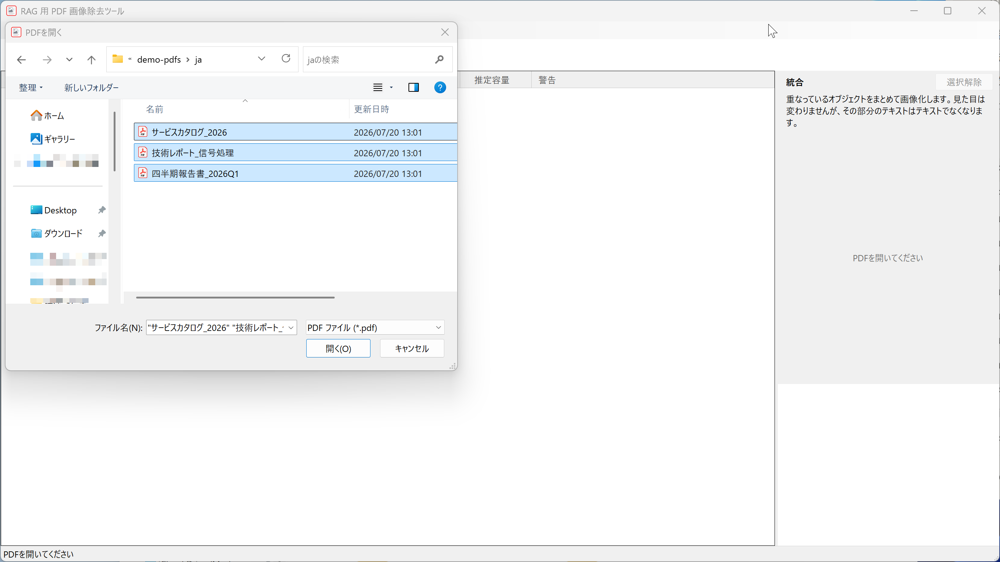
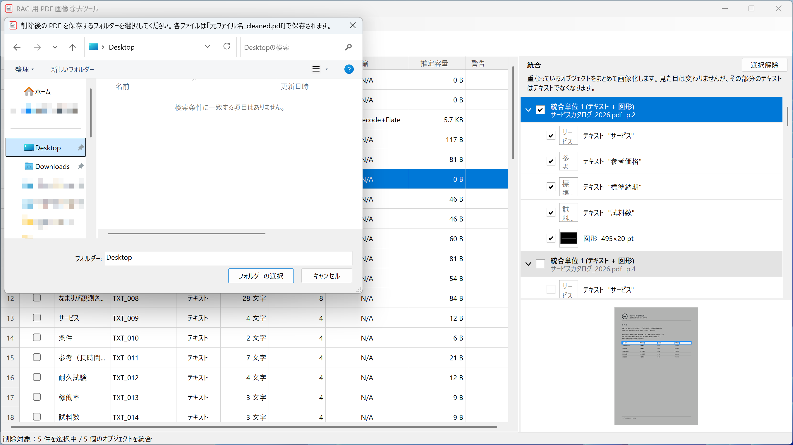
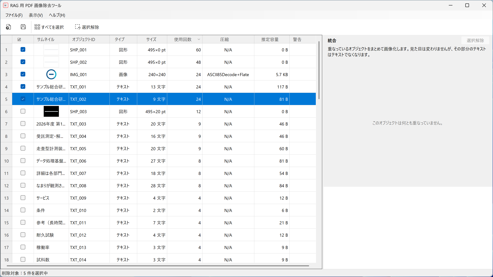
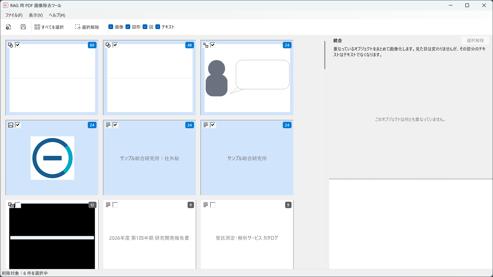
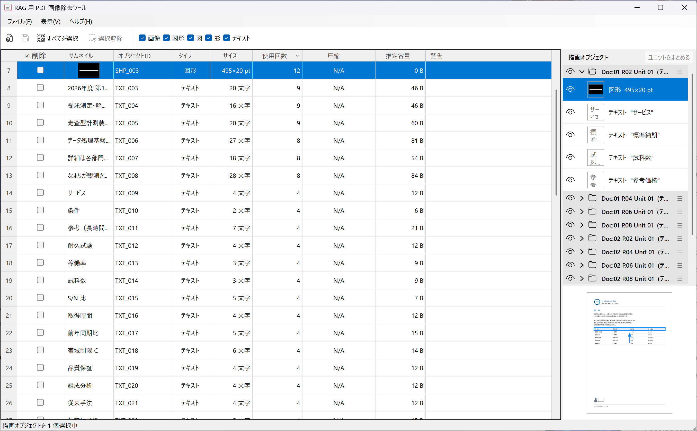

# RAG 用 PDF 画像除去ツール — オンラインマニュアル

**PDF Image Remover for RAG** の使い方です。英語版: [manual.en.md](manual.en.md)

---

## 1. このアプリでできること

RAG（検索拡張生成）に PDF を登録する前に、**検索の邪魔になる余計なオブジェクトを取り除きます。**

会社ロゴ・ヘッダー・フッター・透かし・罫線などは、本文と一緒に取り込まれると検索精度を下げ、前処理コストを増やします。このアプリは PDF の中にあるオブジェクトを一覧表示し、チェックしたものだけを取り除いた**新しい PDF** を保存します。

- **元の PDF は書き換えません。** 保存先は必ず別ファイルです。
- **処理はすべてこの PC の中で完結します。** ファイルが外部に送信されることはなく、データも収集しません。

### 取り除けるオブジェクトは 5 種類

| タイプ | 一覧に出るもの | 補足 |
| --- | --- | --- |
| **画像** | 描画されている画像すべて | 50 ページに出てくる同じロゴは 1 行にまとまります |
| **テキスト** | 空白以外の文字を含み、同じファイル内で **2 回以上**現れる文字列 | 1 文字でも対象です（機密区分を示す「S」など）。空白だけの文字列は出ません。ヘッダー・フッター・透かし向けで、日本語などの 2 バイト文字も正しく読み取ります |
| **図形** | 描画されている線・矩形・曲線すべて | **形状＋線幅＋色**が同じものを 1 行にまとめます（位置は無視） |
| **図** | まとまりとして描かれている絵 | 人物のシルエットと吹き出しのように、複数の線がひとかたまりで置かれているもの。中の線を 1 本ずつではなく、絵ごと消します |
| **影** | 影の効果が残していく画像 | 文書作成ソフトやプレゼンソフトは、図形や文字に付けた影を「単色の画像＋ぼかした形」として書き出します。ページ上では薄い影ですが、他のソフトがファイルから画像を抜き出すと真っ黒な四角になります。下の節を参照 |

回数の絞り込みが入るのは**テキストだけ**です。画像・図形・図・影は全件が一覧に出ます。

### 影が独立した種類になっている理由

図が入るはずの場所に黒い四角が出てくるときは、まずこれが原因です。

PDF にはぼかしを描く命令がないため、影は画像として書き出すしかありません。その画像は
単色（たいていは真っ黒）で、影の形は別のところに、どの位置でその色をどれだけ通すか、
という情報として持たれています。PDF のページを表示するソフトは両方を重ねて描くので、
柔らかい影が見えます。一方、ファイルの中身をオブジェクト単位でたどって画像を抜き出す
ソフトは、画像だけを取り出すことがあります。真っ黒な画像を取り出せば、真っ黒な四角に
なります。

消してもページの見た目はほとんど変わりません。種類を分けてあるのはそのためで、
**影**だけにチェックを入れれば、本物の絵を 1 つずつ確かめなくても一度に片付けられます。
対象は影だけです。光彩・ぼかし・反射は元の図形や文字と一緒に 1 枚の絵として書き出される
ので、ふつうの**画像**のままです。

### やり方は 2 つあります

ウィンドウは左右に分かれていて、**両方が同時に見えています。**

| | 削除 | 統合 |
| --- | --- | --- |
| 場所 | ウィンドウの**左**（オブジェクトの一覧） | ウィンドウの**右**（[描画オブジェクト] パネル） |
| すること | 選んだオブジェクトを取り除く | 重なっているオブジェクトをまとめて画像化する |
| ページの見た目 | そのぶん消える | **変わらない** |
| 使いどころ | ロゴ・ヘッダー・透かし・罫線 | グラフの目盛りラベル、写真の上のキャプションなど、**消すと絵が壊れるが検索の邪魔になる**文字 |

統合については 5 章で説明します。

---

## 2. インストールと起動

Windows 11（x64 / arm64）が必要です。配布ファイルは自己完結型なので、.NET のインストールは不要です。

1. 配布された ZIP を展開します。
2. `PdfImageRemoverForRag.exe` をダブルクリックします。

### 表示言語

表示言語は **OS の表示言語**に従って自動で決まります。対応しているのは次の 16 言語です。

English / 日本語 / 简体中文 / 繁體中文 / 한국어 / Deutsch / Français / Español / Italiano / Português / Русский / Bahasa Indonesia / Bahasa Melayu / हिन्दी / Türkçe / Tiếng Việt

- これ以外の言語の環境では英語で表示されます。
- **アプリ内に言語の切り替えはありません。** Windows の表示言語に従います。
- アラビア語のように右から左へ書く言語には対応していません（画面全体を左右反転する必要があるためです）。
- **マニュアルがあるのは日本語と英語だけです。** ほかの言語では **ヘルプ → オンラインマニュアル** から英語版が開きます。
- **一時的に別の言語で起動する**こともできます。コマンドラインで `--language` を付けてください。Windows の設定は変わらず、その 1 回の起動にだけ効きます。

  ```
  PdfImageRemoverForRag.exe --language en
  PdfImageRemoverForRag.exe report.pdf --language ja
  ```

  指定できるのは上の 16 言語のタグ（`ja` `en` `zh-Hans` `zh-Hant` `ko` `de` `fr` `es` `it` `pt` `ru` `id` `ms` `hi` `tr` `vi`）です。**コマンドラインから exe を直接起動できる zip 版向け**の指定です。

ウィンドウの位置とサイズは終了時に記憶され、次回同じ場所で開きます（ディスプレイ構成が変わっている場合は既定サイズに戻ります）。

---

## 3. 基本の使い方

### 手順

1. **開く** — ツールバーの「PDFを開く」、またはメニューの **ファイル → 開く…** を選びます。
   ファイル選択ダイアログで **複数のファイルをまとめて選べます**。ウィンドウへのドラッグ＆ドロップ、
   および **アプリのアイコンに PDF をドロップして起動**することもできます（zip 版のみ）。

   
2. **確認する** — 解析が終わると、取り除けるオブジェクトが一覧表示されます。初期状態は**使用回数の多い順**です。ロゴやヘッダーのように何度も使われているものが上に来ます。

   サムネイルは画面に出ている範囲のぶんだけ後から作られるので、**開き終わるまでの時間はほぼ解析の時間だけ**です。オブジェクトが数千件ある大きな PDF でも一覧表示できます。解析に時間がかかるときは進捗ダイアログが出て、途中で中止できます（中止すると、その回に開こうとしたファイルはすべて破棄されます）。
3. **選ぶ** — 取り除きたい行の **☑ 列**をクリックしてチェックを付けます。キーボードなら、行を選んで **Space** です。
4. **保存する** — ツールバーの「削除して保存」、またはメニューの **ファイル → 選択項目を削除して保存…** を選びます。
   - 対象ファイルが **1 つ**のとき: 保存ダイアログでファイル名を指定します。
   - 対象ファイルが **複数**のとき: フォルダーを選ぶと、各ファイルが `元ファイル名_cleaned.pdf` として保存されます。

   
5. **完了** — ステータスバーに保存件数と削除箇所数が表示されます。取り除いたオブジェクトは一覧から消えます。

### 「開く」は現在の作業を置き換えます

すでにファイルを開いている状態で新しく開くと、**現在の作業内容は置き換わります**（追加ではありません）。チェック済みのオブジェクトがある場合は、保存するか破棄するかを確認するダイアログが出ます。

複数ファイルをまとめて扱いたいときは、**最初にまとめて選択して開いてください。**

---

## 4. 画面の見方

### 画面の構成

ツールバーの下が左右に分かれています。

- **左 — オブジェクトの一覧。** このアプリの主役で、表形式とタイル形式を切り替えられます。削除のチェックはここで付けます。
- **右 — [描画オブジェクト] パネル。** 左の一覧で**いま選んでいる行**のオブジェクトが、どこで何と重なっているかを示します。幅はウィンドウに対する割合で決まりますが、境界を一度ドラッグすると、以後はその幅が保たれます。

- **ツールバーの「すべてを選択」「選択解除」は、左の一覧にだけ効きます。** 結合は右のパネルで単位ごとに行います（1 クリックで文書中の重なりを全部焼く操作は用意していません。対象が予測できなくなるためです）。パネル側の選択は、別の行をクリックすれば移ります。
- **「削除して保存」は、書き出すものがあれば押せます** — 削除のチェック、閉じた目玉、すでに結合した場所のいずれかです。
- ステータスバーは**両方の件数**を出します（例: `削除対象：6 件を選択中 / 描画オブジェクトを 5 個選択中`）。

### ツールバー

| ボタン | はたらき |
| --- | --- |
| PDFを開く | PDF を選んで開きます（複数選択可） |
| 削除して保存 | チェックしたオブジェクトと、目玉を閉じたオブジェクトを取り除いた PDF を保存します（結合済みの場所はその結果のまま書き出されます） |
| すべてを選択 | 左の一覧で、表示中のオブジェクトをすべてチェックします |
| 選択解除 | 左の一覧のチェックをすべて外します |

### 表（表形式）の列



| 列 | 内容 |
| --- | --- |
| 行番号 | 表の左端。上から連番で振り直されます |
| ☑ | 削除対象のチェック |
| サムネイル | 画像は縮小画像、テキストは文字列そのもの、図形は実際の形と色を描画 |
| オブジェクトID | `IMG_001`（画像）/ `TXT_001`（テキスト）/ `SHP_001`（図形） |
| タイプ | 画像 / テキスト / 図形 |
| サイズ | 画像はピクセル寸法、テキストは文字数、図形は外接矩形の pt |
| 使用回数 | そのオブジェクトが描画されている回数（全ファイル合計） |
| 圧縮 | 画像の圧縮方式。画像以外は `N/A` |
| 推定容量 | 取り除いたときに減ると見込まれるバイト数 |
| 警告 | 「削除不可」「全頁画像?」（→ 7 章） |

### 表の操作

- **並べ替え** — 列見出しをクリックすると並べ替わります。もう一度クリックで昇順／降順が切り替わります（∧ が昇順、∨ が降順）。
- **列幅の変更** — 列の境界をドラッグします。境界を**ダブルクリック**すると左の列が内容に合わせて自動調整されます。
- **まとめてチェック** — ある行の ☑ をクリックしたあと、別の行の ☑ を **Shift を押しながらクリック**すると、その間の行がまとめてチェック／解除されます。
- ☑ 列はセル内のどこをクリックしても切り替わります（チェックボックスを正確に狙う必要はありません）。
- **キーボードだけでも操作できます** — **Space** で現在行の ☑ が切り替わり、**Shift+Space** で直前に切り替えた行からの範囲がまとめて切り替わります。カーソルがどの列にあっても効きます。
- **サムネイルは表示している部分だけ作られます** — スクロールを 0.5 秒ほど止めると、そのとき画面に出ている行のサムネイルが作られて表示されます。それまでサムネイル欄は空欄のままです。空欄が続く場合は、対応していない画像形式（JPEG 2000・CCITT・JBIG2）で、代わりにプレースホルダーのアイコンが出ます。

### タイル形式

**表示 → タイル形式** で、サムネイルを大きく並べたビューに切り替わります。並び順は表と常に同じです。



- タイルをクリックすると**押し込まれた状態**になり、削除対象を意味します。
- 右上のバッジは使用回数です。
- 淡色で押せないタイルは「削除不可」のオブジェクトです。
- サムネイルがまだできていないタイルには「サムネイルを生成中…」と文字で表示されます。表と同じく、スクロールを 0.5 秒ほど止めると画面に出ているぶんが作られて画像に変わります。

**表示 → 表形式** で表に戻ります。

> **スクリーンリーダーをお使いの場合は表形式をお使いください。** タイル形式のタイルは 1 つのコントロールに描画しているため、Windows 標準の**ナレーターからは読み上げられません**（NVDA と JAWS では読み上げられます）。表形式は同じ内容を同じ順序で示し、できることに違いはありません。

### 種類で絞り込む

**ツールバーのチェックボックス**、または **表示 → 表示する種類** で、「画像」「図形」「図」「影」「テキスト」の表示／非表示を切り替えられます。どちらを操作しても同じで、状態は常に一致します。1 種類だけ表示して確認したいときに便利です。**影**だけを残して「すべてを選択」すれば、黒い四角のもとを一度に片付けられます。

最低 1 種類は必ず表示されるため、最後の 1 つのチェックは外せません（外そうとするとチェックが戻ります）。また「すべてを選択」は**表示中の種類だけ**を対象にします。

---

## 5. 重なりを画像に統合する（描画オブジェクトパネル）

### 何のための機能か

グラフの目盛りラベル、写真の上に置かれたキャプション、罫線の上のスタンプ — こういう文字は、**消すと絵が壊れるのに、残すと検索の邪魔になります。**

統合は、その重なっている場所を**見た目そのままの 1 枚の画像に置き換えます。** ページの見え方は変わりません。変わるのは中身で、**その場所のテキストはテキストでなくなります**。RAG のパイプラインが読むのはテキスト層なので、そこから消えるわけです。

削除との違いは 3 つです。

| | 削除 | 統合 |
| --- | --- | --- |
| 消える範囲 | 選んだオブジェクトが**全ファイル**から | 選んだオブジェクトが**その 1 か所**から（同じ文字列の他のページ分は残ります） |
| ページの見た目 | そのぶん消える | 変わらない |
| 画像の数 | 減る | 変わらないか 1 つ増える |

> **統合は押した時点で効きます。** 保存を待ちません。削除のチェックが効くのは保存のときなので、どちらを先にしても構いません。統合をやり直したいときは「統合を解除」で戻せます。

### 対象になる「重なり」

種類の違うオブジェクトが重なっている場所だけが出ます。組み合わせは 4 通りです。

**画像＋テキスト / 画像＋テキスト＋図形 / 画像＋図形 / テキスト＋図形**

- **テキスト同士の重なりは対象外です。** 画像にしても文字が絵になるだけで、得るものがありません。
- 「重なり」には、完全に含まれている場合と、一部だけ重なっている場合の両方が含まれます。
- **塗りのない図形**（枠線・罫線・アウトライン）は、相手の中に**完全に収まっているときだけ**仲間になります。ページ全体を囲む枠線はどの段落とも交差しますが、それは重なりではなく飾りだからです。塗りのある図形（見出しの帯など）は、接していれば仲間になります。
- **ページ全面を覆う図形**（スライドの背景など）は、ページそのものと見なして仲間にしません。塗りがあるので本来はどのオブジェクトとも接してしまい、そのままだと 1 ページ分がまるごと 1 つの統合単位になってしまうからです。**画像は対象外**で、スキャンや全面写真の上のテキストはこれまでどおり統合できます。
- 共有された描画部品（Form XObject）の中身は対象外です（一覧の「削除不可」と同じ理由）。

### 使い方



1. **左の一覧で、調べたいオブジェクトの行を選びます。** 右の [描画オブジェクト] パネルに、**そのオブジェクトが描かれている場所が全部**出ます。最初のひとつが選択された状態で開くので、そのまま操作できます。
   - 何かと重なっている場所は、重なっている相手と一緒に**ひとつの統合単位**になります。
   - 何とも重なっていない場所も、**それだけが入ったユニット**として並びます。ヘッダーやページ番号のように同じものが何十ページにも出る場合、ほとんどはこちらです。
   - 行を選んでいない間、パネルは空です。
2. パネルは**画像編集ソフトのレイヤーパネルと同じ形**をしています。**フォルダーが統合単位**（`Doc:01 P.02 Unit 01` は「1 つ目のファイルの 2 ページ目の 1 つ目の単位」）、その下が**描画オブジェクト**です。フォルダーの左の山形で開閉します。
3. **左端の目玉は「描かれるかどうか」です。** 閉じると、そのページのその場所からそのオブジェクトが消えます — **プレビューからも実際に消え**、保存した PDF にも入りません。**消えるのはその 1 か所だけ**で、同じ画像が他のページにもあればそちらは残ります。フォルダーの目玉は中身全部に効きます。
   - **これが「1 か所だけ消す」やり方です。** 左の一覧のチェックは、そのオブジェクトを**出てくる場所すべて**から消します。「このページの見出しは消したいが、次のページのものは残したい」というときは、パネルで場所ごとに目玉を閉じてください。
4. **行をクリックすると選択です**（Ctrl で足し引き、Shift で範囲）。選択は「どの単位に対して操作するか」を指します。
5. **操作は、ユニットの行の右端にある ☰ にまとまっています。** そのユニットだけが対象です（キーボードでは、その行で Enter・Shift+F10・メニューキー）。
   - **表示中オブジェクトを画像化** — 押した時点で 1 枚の画像になります。**目玉を閉じたものは絵に入りません**（保存で取り除かれるものなので）。**画像化のあと、閉じていた目玉は開いて戻ります** — 「この絵には入れない」という指示は、絵ができた時点で果たされているからです
   - **選択オブジェクトを画像化** — 同じことを、そのユニットの中で**選んだ行だけ**に対して行います
   - **選択オブジェクトを分ける** — 検出された単位が実情と合わないとき、選んだものを別の単位に切り出します
   - **ユニットをまとめる**（パネル右上のボタン）— 同じページの複数の単位を 1 つにします。単位をまたいで選んでから押します
   - **画像化を取り消す** — できあがった画像の行を**左の一覧で右クリック**して戻します。絵になった時点でもとの単位は無くなるので、操作はその画像の行にあります
6. **下段のプレビューは、そのページを実際に描いたものです。** 目玉を閉じたオブジェクトは描かれません。**選択中の描画オブジェクトには水色の枠**が付き、小さいものや細いものには**同じ色の矢印**が添えられます。
7. **保存は削除と同じ**です（ツールバーの「削除して保存」、または **ファイル → 選択項目を削除して保存…**）。結合はすでに効いているので、保存はその結果を書き出します。統合だけでも保存できます。

### 知っておくこと

- **画像化した場所の文字は、選択もコピーもできなくなります。** それがこの機能の目的です。もとの PDF は変わらないので、必要なら開き直せます。
- **結合してできた画像は、ツール → 設定（6 章）で選んだ解像度で作られます。** 周囲の画像と同じ精細さを保つためです。どれを選んでも上限はあります — ページ全体を高解像度で描くと、確保に失敗する大きさのビットマップになるからです。
- **描画できなかった場所は、何もせずそのまま残します。** 先に消してから絵を置けないと、そこが白く抜けてしまうためです。
- **選択した範囲がページのほぼ全体になると、パネルが赤字で注意を出します。** そのまま結合するとページ全体が 1 枚の画像になり、そのページの文字はすべてテキストでなくなるためです。禁止はしていません — キャプションを入れたスキャン頁など、それを承知で行う場面はあります。

---

## 6. 画像を小さくする（ツール → 設定）

**保存のたびに、出力に入る画像を小さく描き直せます。** 既定で有効です。RAG パイプラインに入れる PDF ではほぼ必ず必要になるからで、スクリーンショットの多いマニュアルは 15 MB のアップロード上限に簡単に届き、誰も読まない画素はファイルサイズにしかなりません。

**ページの見た目は変わりません。** PDF は画像を「ページが決めた矩形」に描き、画像の解像度が何であれそこに収めます。だから画素数を減らした同じ絵は、同じ場所に同じ大きさで載ります。

**拡大は決して行いません。** 選んだ解像度より小さい画像は、画素を 1 つも増やさずそのまま残ります。

### 解像度を選ぶ

**ツール → 設定** を開きます。一覧はファイルが小さい順に並んでいます。

| 選択肢 | 何のためのものか |
| --- | --- |
| **画面** - 92 dpi | 最も小さいファイル。眺めるには十分ですが、**細かい文字をパイプラインが読むには足りません**。 |
| **RAG用（ラテン・キリル文字）** - 140 dpi | ラテン文字・キリル文字で組まれた文書。9pt までの文字が読める大きさを保ちます。 |
| **RAG用（CJK・その他の複雑な文字）** - 200 dpi | 日本語・中国語・韓国語・デーヴァナーガリー・ベトナム語。1 文字に収める画数や記号が多いぶん、画素を必要とします。迷ったらこれを選んでください。 |
| **RAG用（微細な文字を含む文書）** - 300 dpi | 本文より小さい脚注・図キャプション・表のセルがある文書。6pt までの文字が読める大きさを保ちます。 |
| **印刷** - 400 dpi | 加工後の PDF を読むだけでなく印刷もする場合。 |

いずれもページ 1 インチあたりの上限です。画像は、それが占める領域に許される画素数を超えないように描き直されます。

**この解像度は推測ではなく実測値です。** 各サイズで文字を描き、このアプリ自身の縮小処理を通してから読み返しました。日本語の 9pt が 1 文字も誤らずに残るのが 200 dpi、6pt が残るのが 300 dpi です。ラテン文字はおよそ半分で足りるため、独立した選択肢にしてあります。

**最も効くのはスキャンページです。** ページ全体が 1 枚の写真になっている文書は、文字も画素として持っています。パイプラインはその画素に写っているものしか読めません。文字が本物のテキストであるページは影響を受けません — 縮小が触るのは画像であって、テキスト層ではありません。

### 設定の代償を目で見る

サンプルが 2 枚、横に並んでいます。どのコントロールを動かしても、保存が実際に通るのと同じ処理を通して描き直されます。2 枚とも「ページ上で幅 3 インチ（A4 の横幅のおよそ 3 分の 1）の絵」という想定です。

- **図版** は、6・8・10・12 pt の文字を合成したグラフです。文字はアプリの表示言語で描かれます。画素を減らしたとき最初に壊れるのは文字で、どこから読めなくなるかは文字体系によって違うからです。
- **写真** は、JPEG ノイズが出る細部となめらかな階調を持っています。

各サンプルの上のキャプションは、保存されたときの姿を示します — バイト数と画素数です。この画素数こそが解像度設定の効果そのものです。

**倍率** は表示を拡大するだけで、保存される内容には影響しません。スライダーの横の数値は段数ではなく**画面上の実倍率**です。50 % なら、保存される大きさの半分で描かれています。だから等倍でも 100 % より下から始まり、解像度を上げるほど下がります。100 % を超えると、画像の中をドラッグ（または矢印キー）で動かせます。

### 画質

**画質** は JPEG の設定で、50〜100、既定は 85 です。

これが届くのは 2 つだけです。**PDF がもともと JPEG で持っている画像**（縮小するときにこの画質で書き直します）と、**画像化した範囲**です。**PDF が可逆形式で持っている画像は、スライダーを動かしても可逆のままです** — 図面・スクリーンショット・線画の輪郭に、あとから輪っかが出ることはありません。図版サンプルがスライダーで変わらず、そう表示するのはこのためです。

もともとこれより低い品質で保存されている JPEG は、書き直さずそのままにします。書き直すと細部が失われ、バイト数がかえって増えることもあるからです。

### 無効にする

**画像を縮小する** のチェックを外すと、すべての画像が入ってきたそのままの形で書き出されます。解像度と画質は画面に残るので、有効にしたら何が適用されるのかは見えたままです。

### ステータスバーの表示

保存後、削除した数・画像化した数と並べて、**小さくした画像の枚数**を表示します。ベクター描画だけの文書では縮小するものが無いので、0 は正常な結果です。

---

## 7. 複数の PDF をまとめて処理する

複数の PDF を開くと、**ファイルをまたいで同一のオブジェクトは 1 行にまとまります**（内容のハッシュで判定）。

同じロゴが 5 つのファイルに入っていれば表示は 1 行で、そこにチェックを 1 回付けるだけで **5 ファイルすべてから取り除かれます**。使用回数は全ファイルの合計です。

保存すると、対象になったファイルの数だけ `_cleaned.pdf` が出力されます。保存先に同名ファイルがある場合は ` (2)` のような連番が付きます。

---

## 8. 警告の意味

### 削除不可

チェックボックスがグレーで押せない行です。そのオブジェクトが**共有された描画部品（Form XObject）の中**にあり、取り除くと他の場所の表示まで壊れる可能性があるため、安全側に倒して削除できないようにしています。

### 全頁画像?

そのオブジェクトが**ページ全体を覆う画像**である可能性を示します。スキャンした PDF によくある形です。

**この行を取り除くと、そのページに見えているものがすべて消えます**（本文を含みます）。スキャン PDF から文字だけを残すことはできません。チェックする前に内容をよく確認してください。

---

## 9. 安全のしくみ

保存は次の順序で行われ、**検証に通ったものだけが最終ファイルになります。**

1. 一時ファイル（`.part`）に書き出す
2. 書き出したファイルを検証する
   - 正しく開けるか
   - ページ数が元と一致するか
   - 取り除いたオブジェクトが本当に消えているか
   - 残すべきオブジェクトが残っているか
3. すべて問題なければ正式なファイル名に変更する（失敗したときは一時ファイルを削除し、何も出力しません）

元の PDF に書き込むことは一切ありません。元ファイルと同じパスを保存先に指定した場合はエラーになります。

---

## 10. できないこと

- **電子署名は維持できません。** 内容を変更するため、署名済み PDF の署名は無効になります。
- **PDF/A への準拠は保証しません。**
- **共有部品（Form XObject）の中は編集しません。**「削除不可」として表示されます。
- **スキャンページの一部だけを消すことはできません。** ページ全体が 1 枚の画像だからです。
- **OCR・類似画像検索・AI によるロゴ判定は行いません。**
- `/ToUnicode` を持たないフォントのテキストは、文字が正しく表示されないことがあります。

詳細: [known-limitations.md](known-limitations.md)（英語）

---

## 11. 困ったとき

| 症状 | 対処 |
| --- | --- |
| 「PDFを開けませんでした」 | パスワード保護された PDF、または破損したファイルの可能性があります。エラーダイアログの「詳細をコピー」で内容を確認できます |
| 「選択されたファイルは PDF ではありません」 | 拡張子が `.pdf` でも、中身が PDF でないファイルは開けません。別の名前で保存された画像やテキストではないか確認してください |
| 一覧に何も出ない | 取り除けるオブジェクトがない PDF です。テキストは「空白以外の文字を含み、2 回以上現れる」ものだけが対象です |
| 保存できない | 元ファイルと同じパスを指定していないか、保存先フォルダーに書き込み権限があるかを確認してください |
| チェックが付けられない | その行は「削除不可」です（→ 7 章） |

**ログの場所**（動作の記録。ファイルのパスや PDF の中身は記録されません）:

```
%LOCALAPPDATA%\PdfImageRemoverForRag\logs\
```

**設定の場所**（ウィンドウ位置・サイズ）:

```
%LOCALAPPDATA%\PdfImageRemoverForRag\window.json
```

**一時ファイルの場所**（サムネイル）:

```
%LOCALAPPDATA%\PdfImageRemoverForRag\cache\
```

サムネイルはメモリではなくこのフォルダーに置かれます。大きな PDF をたくさん開いてもメモリ使用量はあまり増えませんが、そのぶんディスクの読み書きが発生します。このフォルダーはアプリの終了時に削除されます（前回の終了が正常でなかった場合は、次回の起動時に消えます）。

バージョンは **ヘルプ → このアプリについて** で確認できます。

---

## 12. プライバシー

- 開いた PDF、その中身、ファイル名やパスが**この PC の外に出ることはありません。**
- ネットワーク通信は行いません。
- 使用状況の収集・送信は行いません。ログは動作の記録のみで、ローカルに保存されます。

---

## 13. ライセンス

MIT License. Copyright (c) 2026 Nakano Kappei — [LICENSE](../LICENSE)

利用ライブラリ: PDFsharp（MIT）/ PdfPig（Apache-2.0）— [license-notices.md](license-notices.md)

不具合の報告・要望は [GitHub Issues](https://github.com/Nakanokappei/pdf-image-remover-for-rag/issues) へお願いします。
